# TCS Training – Custom Layout and Physical Verification


## Overview

This repository documents my training work in **Custom Layout Design,
Physical Verification, Technology Exploration, and Standard Cell Development**.

The training provided practical exposure to the physical implementation and
verification stages of VLSI design using industry-standard EDA tools and
multiple CMOS technologies.

### Training Details

| Parameter | Details |
|---|---|
| Training | Custom Layout and Physical Verification |
| Project | Standard Cell Library Creation Using GPDK45nm |
| Duration | January 2026 – May 2026 |
| Domain | VLSI / Physical Design / Custom Layout |
| Primary Tools | Cadence Virtuoso, Cadence Assura, Siemens Calibre |
| Technologies Studied | SCL180nm, GF180nm, UMC180nm, GPDK45nm |

---

# Objectives

The major objectives of the training were:

- Understand custom CMOS layout design methodology
- Explore Process Design Kits (PDKs)
- Analyze technology files and layer definitions
- Understand layer mapping and GDSII generation
- Study LEF and CDL files
- Develop and verify Calibre DRC rules
- Analyze CMOS transistor physical structures
- Design and verify a CMOS inverter
- Perform DRC and LVS verification
- Perform parasitic extraction
- Compare pre-layout and post-layout simulation results
- Understand the effect of layout parasitics on circuit performance

---

# Technologies and Tools

## EDA Tools

- Cadence Virtuoso
- Cadence Assura
- Siemens Calibre
- Spectre

## CMOS Technologies

- SCL 180nm
- GF180nm
- UMC 180nm
- GPDK45nm

---

# 1. SCL180nm Technology Exploration

The SCL180nm Process Design Kit was explored to understand the technology
environment used for custom VLSI layout and physical implementation.

The study included:

- Technology file analysis
- Layer definitions
- Layer mapping
- LEF files
- CDL netlists
- Library organization
- Parameterized Cells (PCells)
- Routing resources
- GDSII generation flow
- Technology-dependent design constraints

### Layer Mapping

The layer mapping study examined how layout layers are translated into
fabrication-compatible GDSII layers.

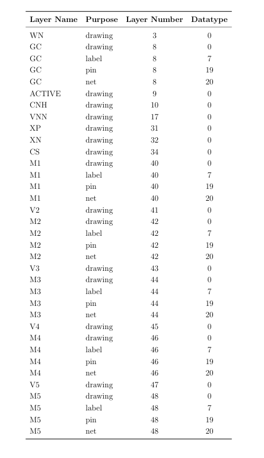

---

# 2. Calibre DRC Rule Development – GF180nm

A Design Rule Check (DRC) deck was developed and verified for GF180nm
technology using Siemens Calibre.

The work focused on physical verification rules related to:

- Metal width
- Metal spacing
- Wide metal spacing
- Minimum metal area
- Via size
- Via spacing
- Via array spacing
- Metal enclosure
- Contact dimensions
- Contact spacing
- Contact enclosure

## Metal-1 DRC Rules

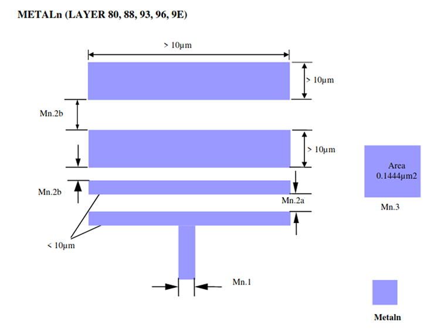

## Via-1 DRC Rules

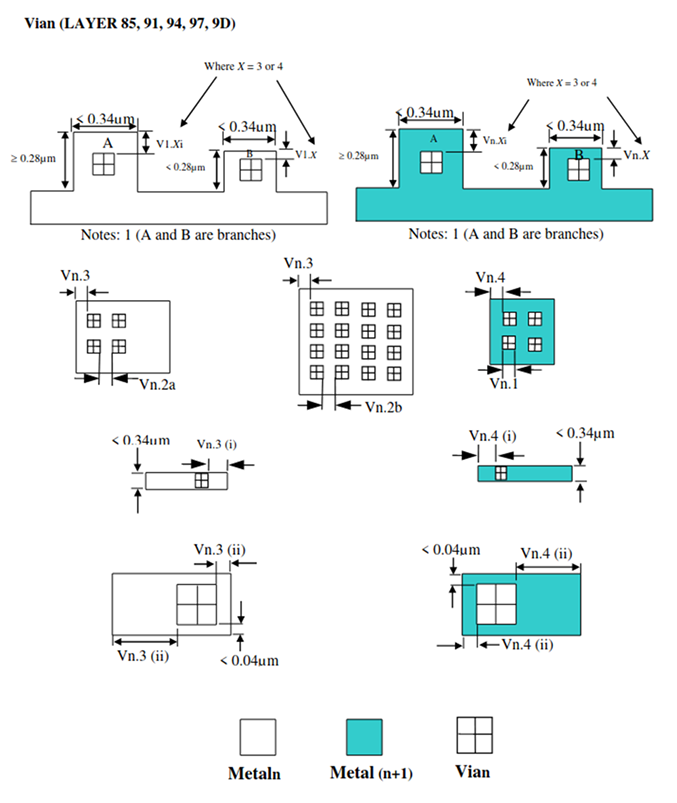

## Contact DRC Rules

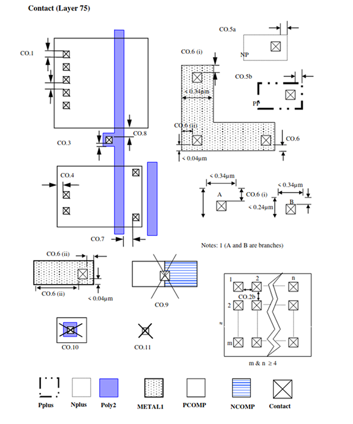

## Calibre Verification

Intentional design-rule violations were introduced in test structures to
validate the developed DRC rules and verify that Calibre correctly detected
the violations.

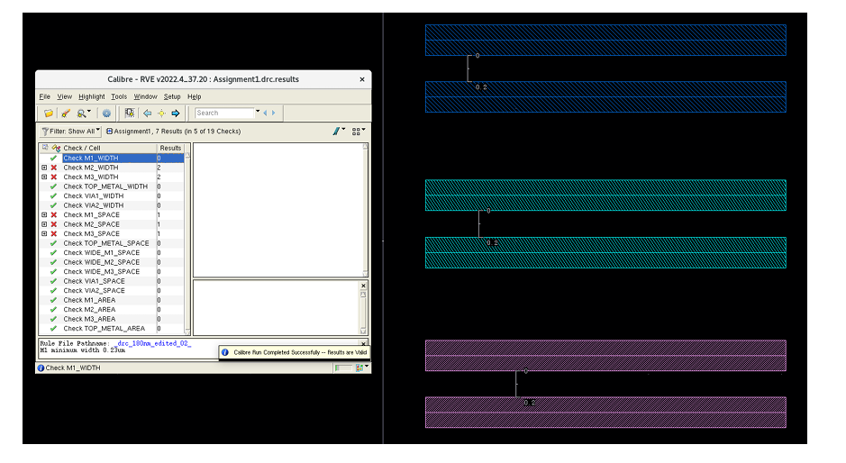

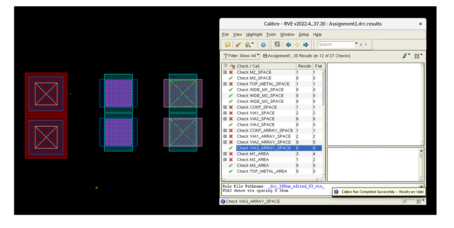

---

# 3. Technology File Development

The training also involved studying and developing technology-file concepts
required for custom layout implementation.

The work covered:

- Layer definitions
- Layer purpose definitions
- Display properties
- Electrical properties
- Layer functions
- Routing directions
- Via definitions
- Technology constraints
- Minimum width rules
- Minimum area rules
- Via spacing rules
- Antenna rules
- Site definitions

This provided an understanding of how process-specific information is
integrated into the Cadence Virtuoso layout environment.

---

# 4. CMOS Transistor Layout Analysis – UMC180nm

CMOS transistor structures were analyzed using UMC180nm technology.

The analysis focused on the physical formation and role of different
semiconductor and interconnect layers.

### Layers Studied

- Substrate
- N-Well
- Diffusion
- Polysilicon
- Contact
- Metal-1

## Step-by-Step Transistor Formation

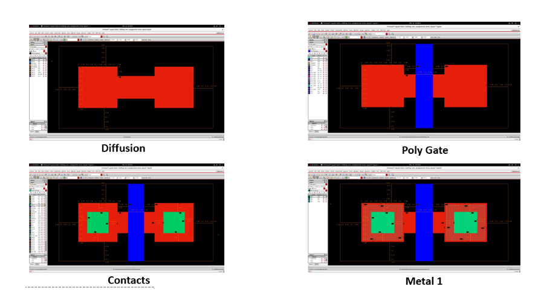

## CMOS Transistor Structure

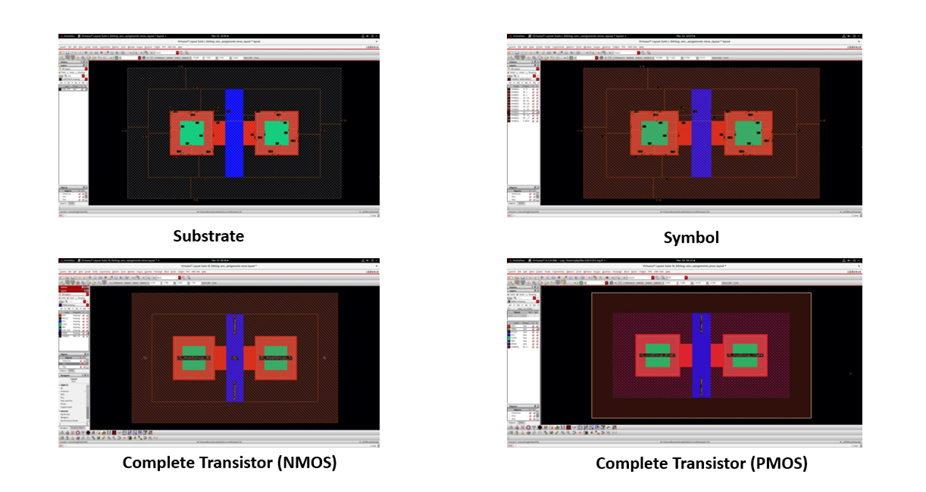

## Layer-by-Layer Layout Analysis

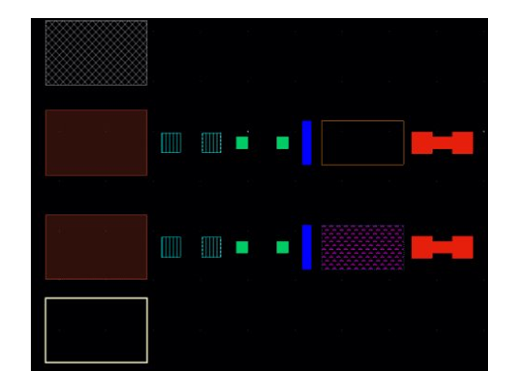

This study helped establish the relationship between CMOS device structures,
physical layout layers, and semiconductor fabrication concepts.

---

# 5. INV-X1 Standard Cell – GPDK45nm

A CMOS inverter standard cell was designed and verified using GPDK45nm
technology.

## Cell Specification

| Parameter | Specification |
|---|---|
| Cell Name | INV-X1 |
| Logic Function | Y = NOT(A) |
| Drive Strength | X1 |
| Technology | GPDK45nm |
| Cell Template | 9T |
| Cell Height | 1.8 µm |
| Pins | A, Y, VDD, VSS |

## Device Implementation

The standard cell consists of:

- PMOS pull-up device
- NMOS pull-down device
- Common input connection
- Common output connection
- VDD and VSS supply connections

---

## 5.1 Schematic

The INV-X1 CMOS inverter schematic was implemented in Cadence Virtuoso.

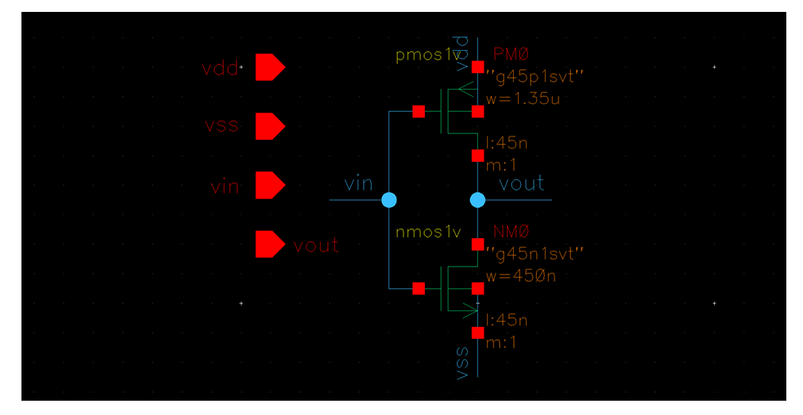

---

## 5.2 Symbol

The corresponding standard-cell symbol was created for circuit integration
and testbench use.

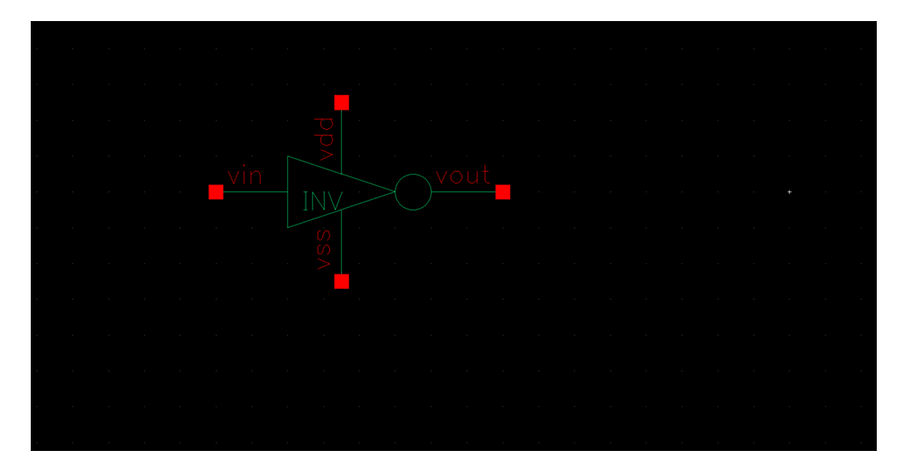

---

## 5.3 Layout

The CMOS inverter layout was implemented using the GPDK45nm technology
environment.

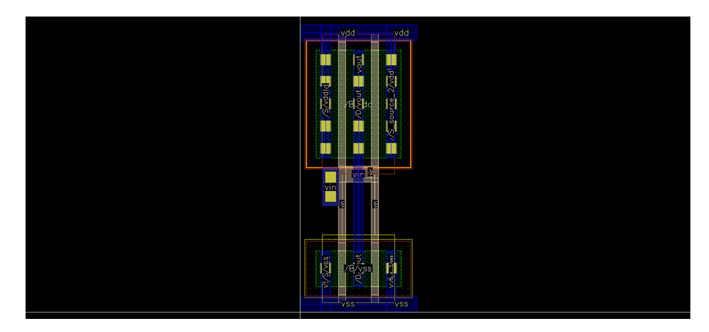

---

## 5.4 Parasitic Extracted View

The layout was extracted to obtain a parasitic-aware representation of the
implemented standard cell.

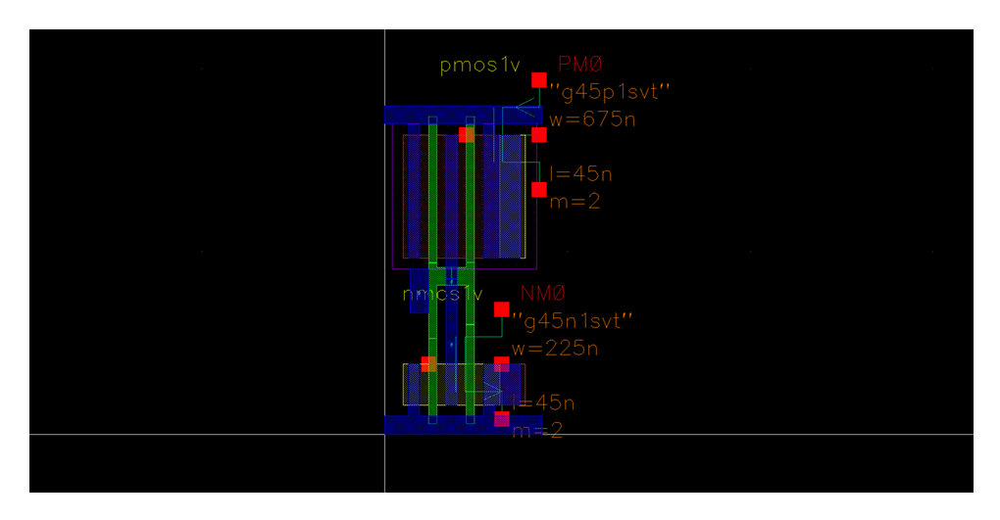

---

## 5.5 Testbench

A testbench was developed to perform transient analysis and verify the
switching behavior of the inverter.

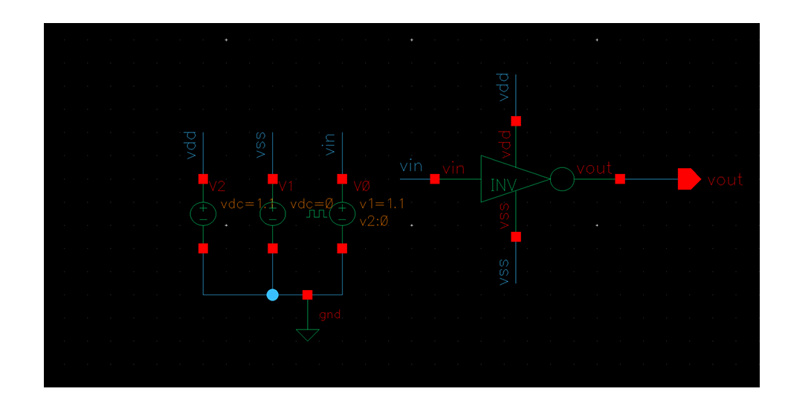

---

# 6. Verification Flow

The overall design and verification flow followed during the training can
be summarized as:

```text
Schematic Design
       ↓
Symbol Creation
       ↓
Layout Implementation
       ↓
DRC Verification
       ↓
LVS Verification
       ↓
Parasitic Extraction
       ↓
Post-Layout Simulation
       ↓
Performance Characterization
```

---

# 7. Pre-Layout vs Post-Layout Analysis

The INV-X1 standard cell was evaluated using transient simulations before and
after parasitic extraction.

The following parameters were analyzed:

- Rise time
- Fall time
- Propagation delay
- Average propagation delay
- Total average power
- Static/leakage power
- Dynamic power
- Cell area

## Characterization Results

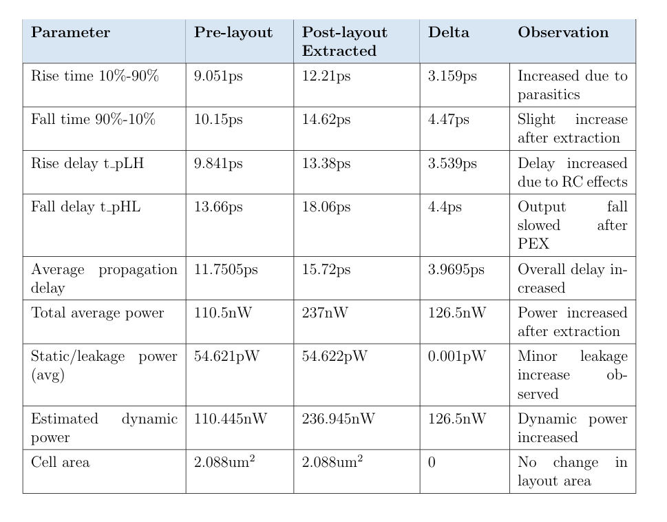

### Observation

Post-layout extraction introduced additional parasitic resistance and
capacitance. As a result, the propagation delay and power consumption
increased, while the cell area remained unchanged.

---

# 8. Key Learning Outcomes

Through this training, I gained practical understanding of:

### Custom Layout

- CMOS transistor layout
- Standard cell layout
- Layout organization
- Routing concepts
- Process layers
- Device formation

### Physical Verification

- Design Rule Check (DRC)
- Layout Versus Schematic (LVS)
- Parasitic Extraction (PEX)
- Calibre-based verification
- Verification rule development

### Technology Exploration

- PDK structure
- Technology files
- Layer mapping
- LEF
- CDL
- PCells
- GDSII generation

### Circuit Characterization

- Rise time
- Fall time
- Propagation delay
- Dynamic power
- Leakage power
- Post-layout parasitic effects

---

# 9. Skills Developed

```text
Custom Layout Design
Physical Verification
DRC
LVS
PEX
Standard Cell Design
PDK Exploration
Technology File Analysis
Layer Mapping
CMOS Layout
Calibre DRC
Cadence Virtuoso
Cadence Assura
Spectre
VLSI Physical Design
Post-Layout Simulation
Circuit Characterization
```

---

# 10. Future Scope

The knowledge gained during this training can be extended to:

- NAND and NOR standard cells
- XOR and XNOR cells
- Multiplexers
- Decoders
- Flip-flops
- Arithmetic circuits
- Complete standard-cell libraries
- Cell characterization
- Timing and power analysis
- Advanced DRC/LVS/PEX methodologies
- Full-custom analog layout
- Mixed-signal layout
- ASIC physical design flows

---

# Disclaimer

This repository contains selected personal learning outcomes, diagrams,
results, and non-confidential material from my training.

No proprietary PDK files, foundry data, confidential rule decks, internal
technology files, or other restricted company information are included.

---

# Author

**Sahil Nadaf**

Electronics and Communication Engineering

KLE Technological University

Interested in:

- Analog & Mixed-Signal IC Design
- Custom Layout
- Physical Verification
- VLSI Design
- Semiconductor Technology
